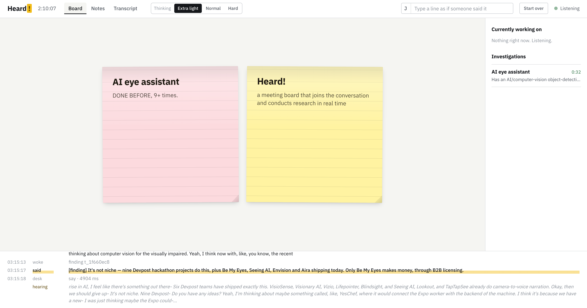

<div align="center">


# Heard!

**A meeting board that joins the conversation.**

</div>

---

## What it does

Heard! is an ambient agent teammate that sits in a working meeting. It
writes down the ideas and the threads of discussion, looks things up, brings
information to the table, answers questions, and joins the discussion when it
has something to add.

- **Takes the meeting notes**, live, as people talk.
- **Sorts what comes up** — ideas, projects, points of discussion — into cards on a shared board.
- **Investigates when needed**: researches an open question and brings back supporting information and options.
- **Speaks up when it should**, joining the discussion with an opinion of its own.
- **Answers questions** from the room, in real time.

<div align="center">



</div>

## SteelHacks XIII

Built in 24 hours at **SteelHacks XIII** (University of Pittsburgh, Sept 19–20, 2026).

**Tracks:** Out Loud! (ElevenLabs) · Beyond the Chatbot (NVIDIA) · Seed Round (Pear VC & Afore Capital) · Xtract (LANXESS)

**Team**

| Name | Email |
|---|---|
| Jiazhen Zhang | jiazhenz026@gmail.com |
| Sam Gombiner | Sam.gombiner@gmail.com |
| Gavin Zheng | gzheng227@gmail.com |

**Links:** Devpost (coming soon) · Demo video / slides (coming soon)

**Tools and AI disclosure**

- Speech: ElevenLabs Scribe v2 (STT) and ElevenLabs TTS
- Models: Nemotron via NVIDIA NIM (classifier, notes agent); Claude via the Claude Agent SDK (front desk, research sub-agents)
- Stack: Python, FastAPI, React + Vite
- The code was written with Claude Code (Claude Fable 5.1).

## Architecture

Speech in, five components, speech out. The Scribe and the harness are plain code.

| Component | Model | Runs | Writes |
|---|---|---|---|
| **STT** | ElevenLabs Scribe v2, realtime | on the room microphone, continuously | committed lines of speech |
| **Scribe** | none | every STT commit | `data/transcript.md` — verbatim, anchored, append-only |
| **Classifier** | Nemotron 3 Super 120B (A12B) via NVIDIA NIM, reasoning off | every 2–5 s of new speech | placeholder cards (< 5 s) + a signal |
| **Notes agent** | same, reasoning off | every ~20 s | `data/notes.md` — the shared context window |
| **Front desk** | Claude Agent SDK, one resident session | woken by a signal or a returning sub-agent | tool calls only: `recall · investigate · say · note` |
| **Sub-agents** | Claude Agent SDK + WebSearch | on `investigate`, max 3 | an HTML page per card + a summary |
| **TTS** | ElevenLabs, streamed | on every `say` the harness lets through | audio to the board, with an echo guard |

The two Nemotron components are on the 5-second clock, so they run Super
with reasoning off: a one-second JSON answer matters more than deep thinking.

Between `say` and the speakers sits the **harness**, plain code: `say` must
carry a reason the runtime can check (`asked` — someone addressed Heard in the
last 20 s; `finding` — a named task returned and has not been spoken), one
unsolicited line per 90 s, two sentences max, and the floor waits for a gap
in the room. Every layer fails towards silence.

```
STT (ElevenLabs Scribe v2)
  → SCRIBE → transcript.md
      → CLASSIFIER → card + signal ─┐
      → NOTES AGENT → notes.md      │
                                    ▼
                               FRONT DESK ── investigate ──► SUB-AGENT ──► /cards/{id}.html
                                    │ say
                                 HARNESS → floor → TTS (ElevenLabs) → board
```

## Run it

```bash
cp .env.example .env        # NVIDIA_API_KEY, ELEVENLABS_API_KEY (+ voice id)
uv venv && uv pip install -e ".[dev]"
cd board && npm install && npm run build && cd ..
.venv/bin/python main.py    # http://127.0.0.1:8000
```

The front desk and the researchers run on the Claude Agent SDK, which drives
the bundled `claude` CLI. Either run `claude login` once on the machine, or set
`ANTHROPIC_API_KEY`.

Click **Start listening** on the board: that one gesture grants the microphone
and unlocks audio. With no ElevenLabs key the board falls back to the browser's
own speech recognition and nothing is spoken.

### Without a microphone

Everything can be driven by text, which is how it is tested:

```bash
.venv/bin/python scripts/replay.py fixtures/demo.txt        # the demo meeting, timed
curl -X POST localhost:8000/inject -H 'content-type: application/json' \
     -d '{"text":"Heard, has anyone built this before?","speaker":"J"}'
```

There is also a type-a-line box in the board's top bar.

### Endpoints

| Route | What |
|---|---|
| `WS /ws` | full state on connect and after every change; `partial`, `audio` |
| `GET /cards/{id}` | the sub-agent's HTML page for a card |
| `GET /transcript.md` · `GET /notes.md` | the two files, raw |
| `POST /inject` | a line as if spoken |
| `POST /reset` | back to an empty meeting |
| `GET /healthz` | which providers are live, wake and pass counts |

### Configuration

Everything is in `.env.example`. The ones that matter on stage:

- `NEMOTRON_MODEL_ID` — defaults to `nvidia/nemotron-3-super-120b-a12b` with reasoning off (`HEARD_DISABLE_THINKING=true`); the classifier is on the 5-second path.
- `HEARD_STT_KEYTERMS` — names Scribe is biased towards (`Heard`, the product names). Add the ideas you plan to pitch.
- `HEARD_UNSOLICITED_GAP_S` — how often it may speak without being asked.
- `HEARD_RESEARCH_EFFORT` / `HEARD_RESEARCH_MODEL` — research speed vs depth.
- `--no-audio` — log spoken lines instead of synthesising them.

## Layout

```
heard/
  store.py        the store and the Scribe (commit = one anchored line)
  classifier.py   Nemotron, JSON, creates placeholder cards directly
  notes.py        Nemotron, rewrites notes.md
  frontdesk.py    Claude Agent SDK session + the four tools
  research.py     one SDK run per investigation → HTML page
  harness.py      say → reason check → budget → floor → TTS
  nim.py          NIM client + loose JSON parsing
  speech/         Scribe v2 realtime, TTS streaming, echo guard
  server/         FastAPI app, WebSocket hub
board/            React + Vite: canvas, task rail, transcript strip, notes view, banner
fixtures/demo.txt the scripted demo meeting
scripts/replay.py posts a fixture to /inject with timing
```

## Nemotron

The classifier and the notes agent run on Nemotron through NVIDIA NIM: the two
components on the clock, where a one-second JSON answer matters more than deep
reasoning. [`docs/NEMOTRON.md`](docs/NEMOTRON.md) explains the split, and
`eval/classifier_bench.py` scores the classifier across Nemotron models and
reasoning modes on a labelled set of meeting moments (latency, valid JSON,
spurious cards, verbatim names, addressed precision/recall). Results are in
`eval/results/`.
